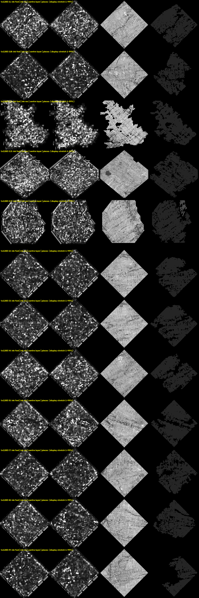

# orgsec-ink (package orgseg_ink): public ink models on organizer segments, with the honest result

A CPU-only, reproducible way to run the two public Herculaneum ink models on segments the organizers already published, straight from the open-data bucket, plus two tests of what the maps mean. And the result of doing it on two eligible scrolls: nothing. We publish the nulls so the next person starts where we stopped.

## Quick start (1 minute, no model needed)
```bash
pip install -e . && pytest                 # 3 synthetic tests
bash scripts/reproduce_tests.sh            # agreement + row-score on the included half-resolution maps
```
All 26 organizer-sheet maps from both layer orders are included at half resolution under `results/maps_half/` (plus the two Grand Prize model maps), so every number in the CSV can be checked without running a model. Full pipeline: `scripts/orgseg_run.sh` (needs the organizers' villa stack and docker).



## What is in it
- `scripts/orgseg_run.sh <sv0800|tx1203> <k>`: fetches organizer segment k of PHerc0800 (its published 31-layer surface volume) or PHerc1203 (tifxyz, rendered here with `vc_render_tifxyz`), runs the organizers' ink_9um model (hybrid_3d2d-seed42, step 75000) in both layer orders, writes PNG maps + JSON stats. Needs docker, the organizers' villa `vesuvius` package and checkpoint, and 4 CPUs; one segment takes 5-15 min.
- `scripts/gp_sheet.sh <k>`: the 2023 Grand Prize TimeSformer (scrollprize/timesformer_GP_scroll1, villa inference code) on the same segment, scale-matched to its 7.91 µm training data.
- `orgseg_ink/agree.py A B um out.json`: do two models mark the same places? Pearson r of 0.5 mm-smoothed maps against rotated and flipped controls.
- `orgseg_ink/rowscore.py px_per_mm maps...`: a row-periodicity score (3.5-8 mm line pitch, angle search ±45°).
- `orgseg_ink/pieces.py render.zarr out`: splits a render's centre layer into connected on-papyrus pieces at dark seams.

## Results on real data (all in `results/`)
- `organizer_sheets.csv`: 26 organizer segments, PHerc0800 (6; 8.64 µm, 116 keV) and PHerc1203 (20; 9.362 µm, 113 keV, the ink_9um model's native scan), 1.7-4.1 cm wide, both directions. Fraction of the map above 0.5: PHerc0800 0.018-0.060, PHerc1203 0.012-0.158, maximum pixel never above 0.90. Inspected at full resolution: blobs 1-3 mm, no row alignment, no strokes, forward and reverse unrelated. Montages: `PHerc0800_organizer_sheets_montage.png`, `PHerc1203_organizer_sheets_montage.png`.
- `agree_PHerc0800_i1_ink9um_vs_gp.json`: ink_9um vs Grand Prize model on the same sheet, r = 0.134; best control 0.097. On PHerc1203 i13: r = 0.31 vs control 0.17; i15: r = 0.20 vs control 0.11 (`results/agree_*.json`). Weak at best; the two models largely do not agree on where the blobs are.
- `rowscore_calibration_PHerc0139_vs_PHerc0268.json`: the row score on 112 known-text tiles (PHerc0139 organizer segments) against 144 tiles from cross-winding surfaces of PHerc0268: only 1.8 % of the known-text tiles exceed the junk 99th percentile. **The row score is not a usable text detector at 2 cm tile scale**; fibre and crush periodicity score as high as text. It passes its synthetic test and fails the real one; both are reported.
- Pitfall, documented in the `xsec` package: surfaces from `vc_grow_seg_from_seed` without the organizers' normal grids cut across windings; with them they hold a layer between cracks and jump at cracks. Organizer segments were used here precisely to take our grower out of the chain.

## What this means
On these 26 flat organizer sheets, neither public model produced text-like structure, and they do not agree with each other. Either these particular 2-4 cm patches carry no ink, or the models trained on PHerc0139 / Scroll 1 do not transfer to these scrolls. We cannot tell which; nobody should treat a null from these models on a new scroll as evidence of blank papyrus.

## Install and test
`pip install -e .` then `pytest` (3 synthetic tests). The shell scripts need the organizers' villa stack; see their headers. Companion tools: [xsec](https://github.com/abundantjoe/xsec) and [ringstrip](https://github.com/abundantjoe/ringstrip).

## Data and citation
Scans and segments: PHerc0800 (volume 20250521135224), PHerc1203 (volume 20250820131727) and PHerc0268 (volume 20251110183117); known-text calibration tiles from PHerc0139 organizer segments. All from the Vesuvius Challenge open-data bucket (https://scrollprize.org/data; Data Browser https://scrollprize.org/data_browser). Cite:
> Giorgio Angelotti, Stephen Parsons, Sean Johnson, Elian Rafael Dal Prà, Johannes Rudolph, Paul Tafforeau, Alessandro Mirone, Paul Henderson, Hendrik Schilling, Forrest McDonald, David Josey, Youssef Nader, C. Seth Parker, W. Brent Seales. *Vesuvius Challenge - CT Scans of Herculaneum Papyri*. Vesuvius Challenge.

Models and code credited: the organizers' ink_9um checkpoint and `vesuvius` inference code (Vesuvius Challenge "villa"); the 2023 Grand Prize TimeSformer by Youssef Nader for the Grand Prize team (MIT; hosted by the organizers on Hugging Face as scrollprize/timesformer_GP_scroll1) and the villa `optimized_inference` code; volume-cartographer (`vc_render_tifxyz`). Code MIT; `results/` CC BY-NC 4.0.

Built by an individual with the help of AI coding agents (Claude Code); every number is reproducible from the scripts and the public bucket.
